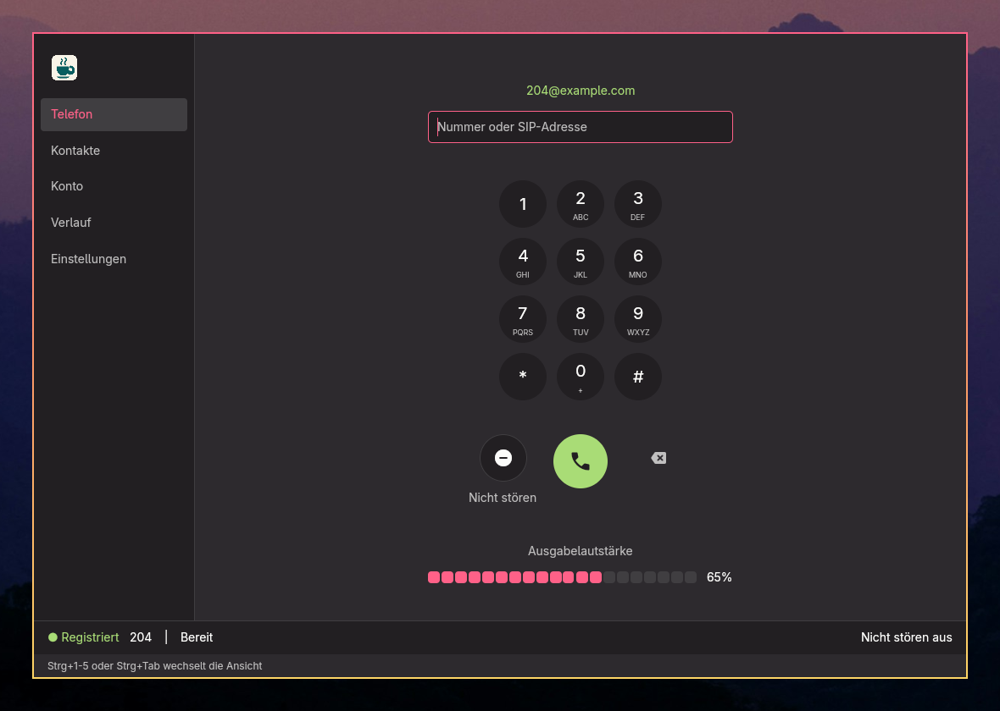
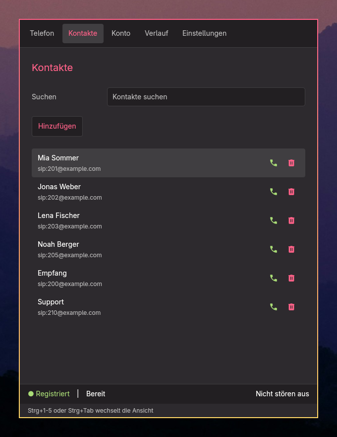
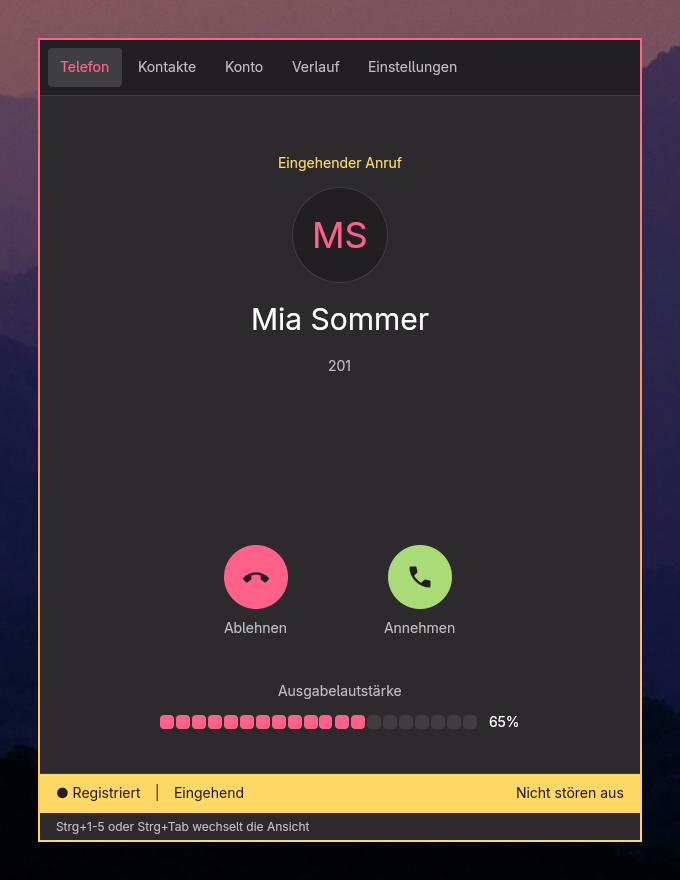

# GoSipTea client

Rust-/GPUI-Port von GoSipTea für das aktuelle Omarchy-System. Das Projekt ist eigenständig und benötigt weder den Go-Quellbaum noch das Go-Binary.

## Showcase

Die Telefonansicht im breiten Fenster mit Seitenleiste. Alle Aufnahmen zeigen erfundene Demo-Daten.

[](docs/screenshots/desktop-phone.png)

In schmalen Fenstern wandert die Navigation nach oben:

| Kontakte | Eingehender Anruf |
| --- | --- |
| [](docs/screenshots/compact-contacts.png) | [](docs/screenshots/compact-incoming.png) |

[Alle Ansichten in beiden Fenstergrößen](docs/screenshots/README.md) · [Screenshots als ZIP](docs/demo-screenshots.zip)

## Bauen und starten

Benötigt werden Rust ab Version 1.88, Cargo, ein Vulkan-fähiger Grafiktreiber, baresip mit `ctrl_dbus` und PipeWire, `wpctl`, `notify-send` und ein Session-D-Bus. GPUI benötigt außerdem die Linux-Entwicklungsbibliotheken für Wayland, X11 und xkbcommon. `Cargo.lock` hält die geprüften Abhängigkeiten fest, darunter GPUI 0.2.2.

```sh
make build
./target/release/gosiptea-client
```

Standardmäßig liest die Anwendung `~/.baresip`. Ein bereits vorhandener Eigentümer von `com.github.Baresip` verhindert den Start. Die Anwendung stoppt oder verändert keinen fremden baresip-Dienst.

Ein Start ohne produktives Konto ist mit einem temporären Verzeichnis und eigenem D-Bus möglich:

```sh
test_dir=$(mktemp -d)
dbus-run-session -- ./target/release/gosiptea-client --config-dir "$test_dir"
```

Dabei keine produktiven Kontodaten eintragen. Das temporäre Verzeichnis nach dem Test selbst entfernen. baresip kann darin Beispielkontakte anlegen.

Die ursprünglichen Optionen bleiben erhalten. Einfache und doppelte Bindestriche funktionieren:

- `--config-dir PATH`
- `--baresip PATH`
- `--country-code CODE`, standardmäßig `49`
- `--baresip-log PATH`
- `--sip-trace`, nur zusammen mit `--baresip-log`

baresip-Ausgaben bleiben ohne explizite Logdatei deaktiviert. Logs und SIP-Traces können Rufnummern und Zugangsdaten enthalten.

`make build`, `make install` und `make update` verwenden immer den optimierten Release-Build, einschließlich aller Abhängigkeiten. Installation und Update legen das Binary sowie einen Desktop-Eintrag unter `~/.local` ab. `PREFIX` überschreibt diesen Pfad. Eine laufende Instanz bleibt beim Update unangetastet; der neue Build wird beim nächsten Start verwendet. Eine vorhandene Go-Installation bleibt bestehen.

Nur für die Entwicklung: `cargo build --locked` erzeugt den unoptimierten Build unter `target/debug`. Dieser wird nicht installiert.

## Bedienung

Ansichten, Reihenfolge und Statuszeile folgen der TUI. Nur die Audio-Ansicht fehlt, ihre Geräteauswahl liegt in Settings und der Lautstärkeregler in Phone. Die Buchstaben-Kürzel der TUI gibt es hier nicht, die Buttons tragen deshalb keine Tastenhinweise. Breite Fenster zeigen eine Seitenleiste, schmale Fenster eine obere Navigationszeile. GPUI verwendet Entities, Actions, Fokus und Subscriptions wie Zed; hinzugefügte Editor-, Dock- oder Telefoniefunktionen gibt es nicht.

Die Ansicht wechselt per Klick in der Navigation oder per Tastatur. `Ctrl+1` bis `Ctrl+5` öffnen Phone, Contacts, Account, History und Settings, `Ctrl+Tab` und `Ctrl+Shift+Tab` blättern vor und zurück. Die Kürzel funktionieren auch in Textfeldern. Weitere Kürzel gibt es nicht, alles andere läuft über die Maus. Nur in der Phone-Ansicht wirkt die Tastatur ohne vorherigen Klick. Ohne Anruf landet jede Eingabe im Dial-Feld, im Gespräch gehen Ziffern an das offene Keypad.

- Phone: Das Dial-Feld hat beim Öffnen den Fokus, man kann also sofort tippen. Auch nach Esc landet die nächste Taste wieder im Feld. Darunter liegt ein Wähltastenfeld wie in der Android-Telefon-App. Der grüne Button wählt die Nummer. Ist das Feld leer, setzt er den Cursor hinein. Links davon schaltet DND um, rechts löscht Backspace das letzte Zeichen. Unter diesen drei Buttons sitzt der Lautstärkeregler. Ein Klick darauf setzt die Lautstärke in 5-%-Schritten.
- Anrufbildschirm: Geht ein Anruf ein oder beginnt ein ausgehender, wechselt die App auf Phone. Der Aufbau folgt der Android-Telefon-App. Oben stehen Status, Initialen, Name und Nummer, unten die runden Buttons. Ein eingehender Anruf hat „Decline“ links und „Answer“ rechts. Im Gespräch gibt es Mute, Keypad, Hold, DND und Auflegen, darunter wieder den Lautstärkeregler. Das Keypad sendet jede Ziffer sofort als DTMF. Das gilt für angeklickte Tasten und, solange das Keypad offen ist, auch für Ziffern, `*` und `#` von der Tastatur. Andere Tasten haben im Gespräch keine Wirkung. Während Hold sind Mute und Keypad gesperrt. In den anderen Ansichten führt ein Banner über dem Inhalt zurück zum Gespräch.
- Contacts: Ein Klick wählt einen Eintrag aus. Rechts stehen Icons zum Anrufen und Löschen. „Add“ öffnet das Formular.
- Account: In die Felder klicken, „TLS and SRTP“ umschalten, mit „Save account“ speichern. Ein leeres Passwort behält das gespeicherte.
- History: Ein Klick wählt einen Anruf aus, „Dial“ ruft erneut an.
- Settings: Sprache, Design und Audiogeräte. „Dark“ und „Light“ sind feste Monokai-Pro-Paletten. „Omarchy“ übernimmt die Farben aus `~/.local/state/omarchy/current/theme/colors.toml`. Ältere Omarchy-Versionen legen die Datei unter `~/.config/omarchy/current/theme/` ab, auch dort sucht die App. Die Datei wird jede Sekunde neu gelesen, ein Themewechsel mit `omarchy-theme-set` erscheint also ohne Neustart. Fehlt die Datei oder ein Farbwert, springt die passende feste Palette ein. Darunter stehen die Listen für Output, Input und Ringtone. Ein Klick auf einen Eintrag übernimmt das Gerät.
- Beenden geht über das Schließen des Fensters. Während eines Gesprächs fragt die App vorher nach.

In Textfeldern gelten die üblichen Eingabetasten. Enter wählt im Dial-Feld und speichert im Adressfeld eines neuen Kontakts, Tab springt zum nächsten Feld, Esc verlässt das Feld.

## Architektur

- `src/domain.rs`: reine Anrufzustände, Registrierung, Kontaktabgleich, Normalisierung und Textbegrenzung.
- `src/storage.rs`: kompatible baresip-Dateien, restriktive Rechte, atomare Schreibvorgänge und Erstkonfiguration.
- `src/platform.rs`: eigener baresip-Prozess, verifizierte D-Bus-Verbindung, PipeWire, MPRIS, Benachrichtigungen und Hyprland-Fokus.
- `src/session.rs`: ein Worker serialisiert Aktionen und Ereignisse. Die Oberfläche bekommt kopierte Snapshots ohne gespeichertes Passwort.
- `src/ui.rs`: GPUI-Workspace mit Seitenleiste, Inhaltsbereich, Statuszeile und Beenden-Dialog.
- `src/input.rs`: begrenzte Unicode-Eingabe mit IME, Auswahl, Zwischenablage und Passwortmaskierung.
- `src/assets.rs`: ins Binary eingebettete Icons für den Anrufbildschirm.

Der Umfang bleibt auf ein Konto und ein gleichzeitiges Gespräch begrenzt. Ein abweichender Klingelausgang wird wie im Original erst nach einem Neustart wirksam. Der Verlauf enthält maximal 200 Versuche in `gosiptea-call-history.json`. Eingehende Anrufe pausieren MPRIS-Player, benachrichtigen den Desktop und fokussieren das Fenster. Globale Tastenkürzel und Benachrichtigungsaktionen bleiben ausgeschlossen.

Der Lautstärkeregler ist die einzige Funktion, die das Original nicht hat. Er steuert die Systemlautstärke des in Settings gewählten Ausgabegeräts, auch ohne laufenden Anruf. Steht dort „System default“, folgt er dem aktuellen Standard-Ausgabegerät. Änderungen am Systemregler erscheinen in der Phone-Ansicht innerhalb etwa einer Sekunde. Weil die Gerätelautstärke für alle Programme gilt, ändert der Regler auch deren Lautstärke auf diesem Gerät. Bei „Same as output“ betrifft das ebenso den Klingelton; ein separat gewähltes Klingelgerät behält seine eigene Lautstärke. Das Mikrofon hat keinen Regler.

## Prüfungen

```sh
make check
```

Die Tests nutzen temporäre Dateien, simulierte SIP-Ereignisse und für Prozess-/D-Bus-Tests private Busse mit Testkindprozessen. Sie verwenden keine produktiven SIP-Konten. GPUI-Interaktionstests laufen über dessen Testplattform.

`make smoke` prüft den Release-Build und öffnet auf dem laufenden Hyprland-Desktop ein echtes GPUI-Fenster mit temporärer Konfiguration und privatem D-Bus. Der Test prüft den baresip-Eigentümer, das fehlende SIP-Konto und das vollständige Beenden des eigenen Kindprozesses. Er ist im normalen Testlauf bewusst ausgenommen.

Ein echter Verbindungsaufbau mit SIP-Server, Gegenstelle und Audio bleibt ein manueller Test. Der isolierte Start prüft den echten baresip-Prozess und das GPUI-Fenster, aber keine Telefonverbindung.

## Referenzen und Lizenz

- Ursprüngliches GoSipTea, unverändert im benachbarten Projekt.
- [Zed](https://github.com/zed-industries/zed), insbesondere Workspace-Aufbau und GPUI-Entity-Modell.
- [GPUI](https://gpui.rs/) und das Eingabebeispiel der Version 0.2.2.
- [Material Symbols](https://github.com/google/material-design-icons) für die Icons des Anrufbildschirms.

Die MIT-Lizenz des Ursprungsprojekts steht in `LICENSE`. `src/input.rs` enthält den Herkunftshinweis und die Apache-2.0-Lizenz des verwendeten GPUI-Beispiels. Die Icons unter `assets/icons` stehen ebenfalls unter Apache 2.0, die Lizenz liegt in `assets/icons/LICENSE`.
