# Demo screenshots

14 native captures of Sippy with made-up data, the English UI and the dark theme.

- Desktop: 1100 × 760 pixel window, 1180 × 840 pixel screenshot, status mascot and navigation in the sidebar.
- Compact: 600 × 800 pixel window, 680 × 880 pixel screenshot, status mascot in the header with navigation below.
- The mascot is pink when ready and green for the incoming demo call. Live sessions also use purple for do not disturb and red without registration.
- A 40 pixel margin on every side shows the real window border and part of the wallpaper.
- Account, contacts, devices, registration and calls are simulated. The demo backend starts no baresip and reads no personal account data.

| View | Desktop | Compact |
| --- | --- | --- |
| Phone | [](desktop-phone.png) | [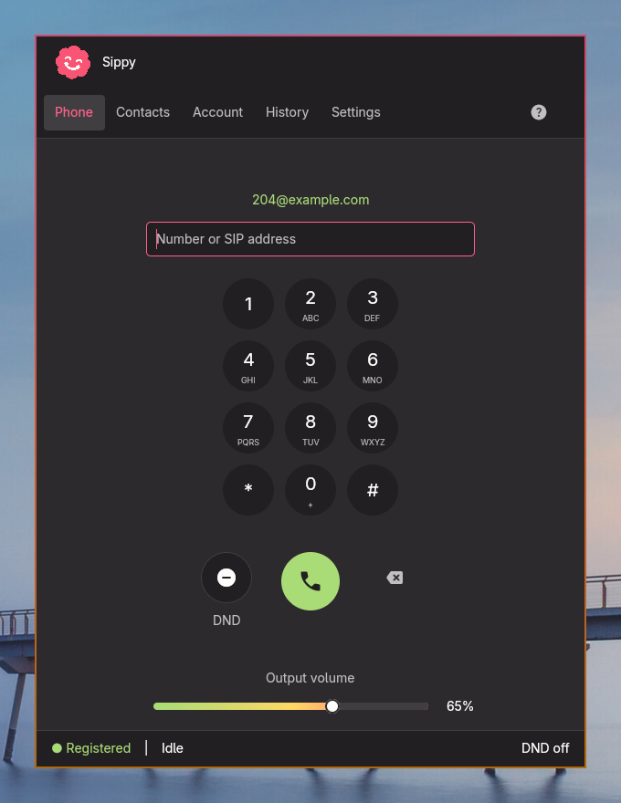](compact-phone.png) |
| Contacts | [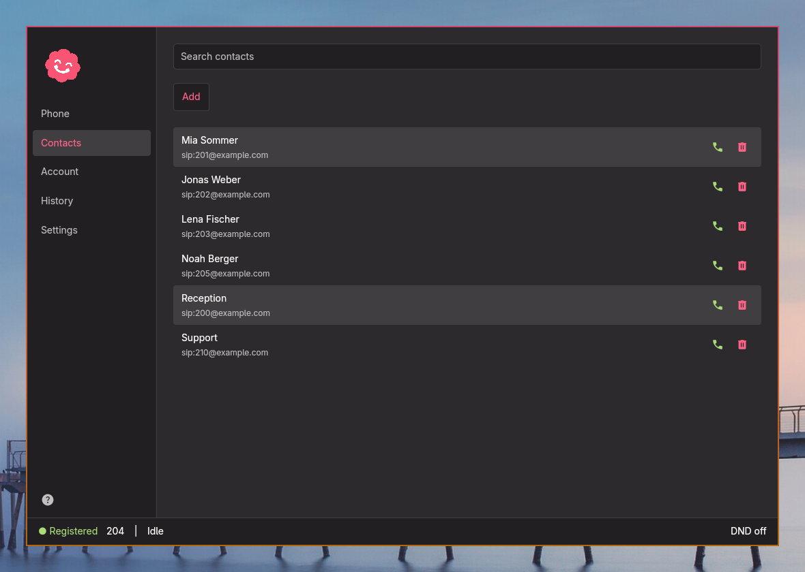](desktop-contacts.png) | [](compact-contacts.png) |
| Account | [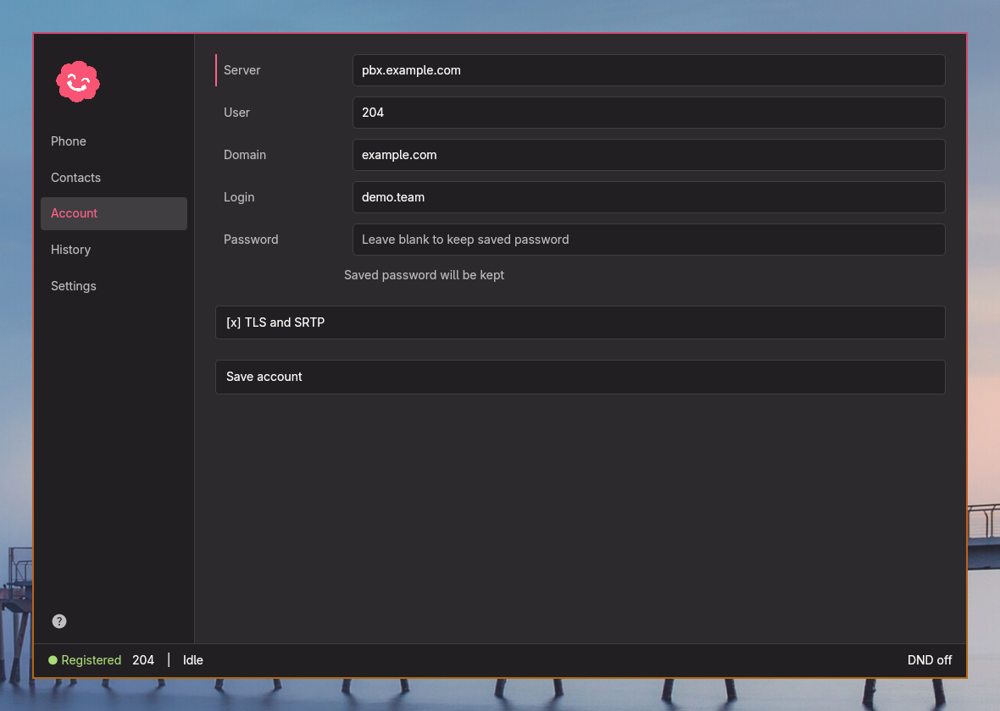](desktop-account.png) | [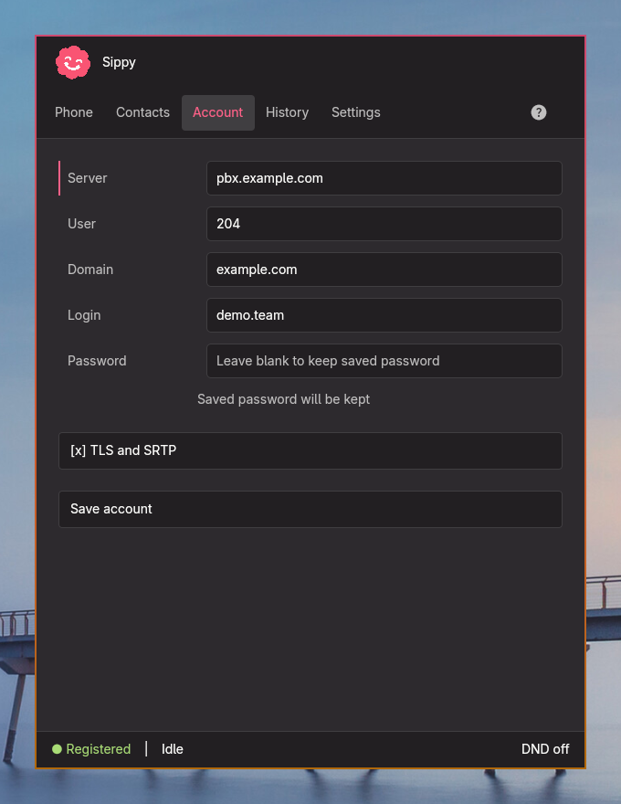](compact-account.png) |
| History | [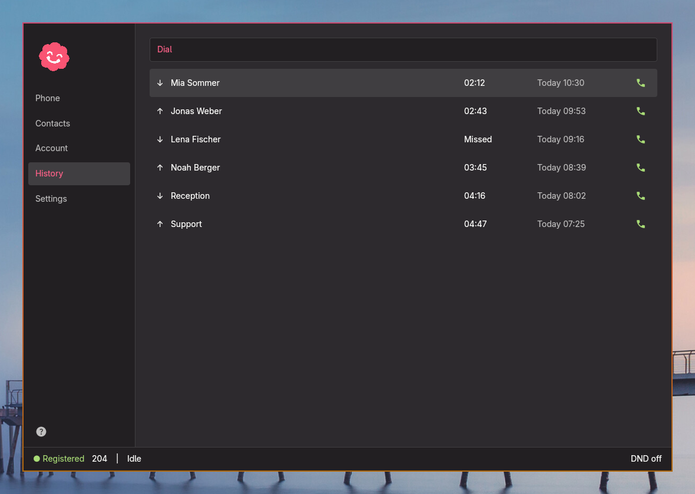](desktop-history.png) | [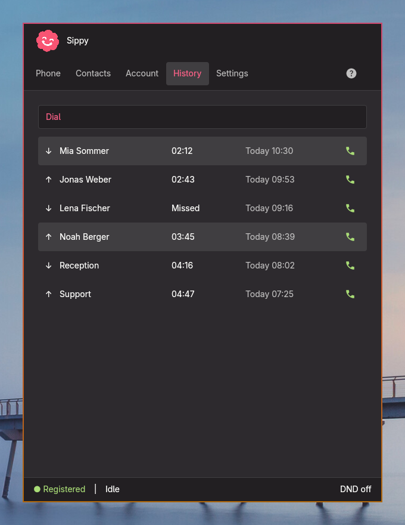](compact-history.png) |
| Settings | [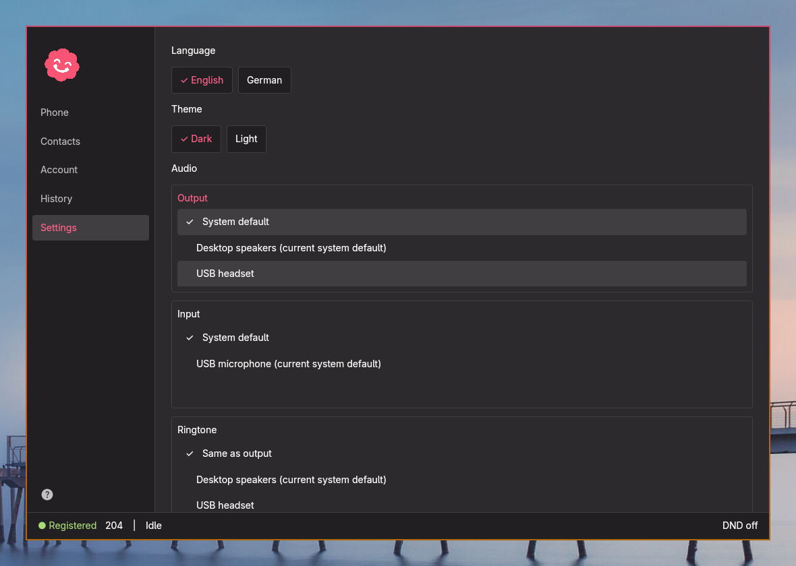](desktop-settings.png) | [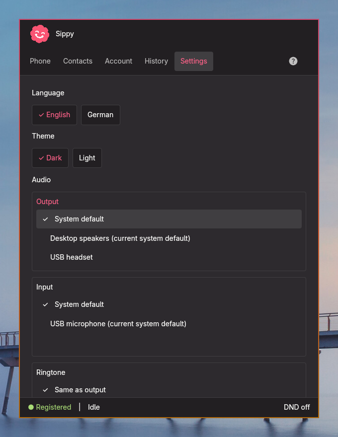](compact-settings.png) |
| Help | [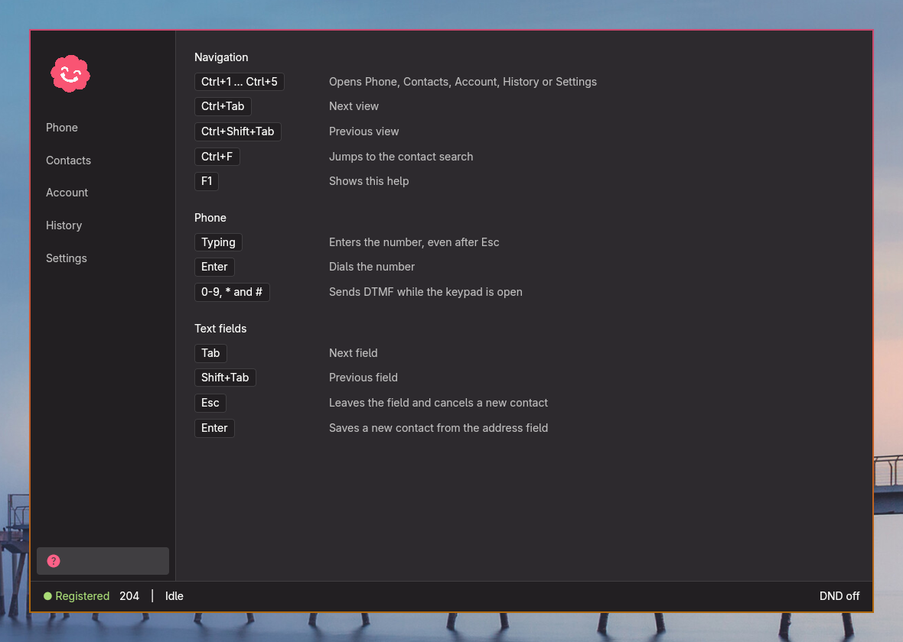](desktop-help.png) | [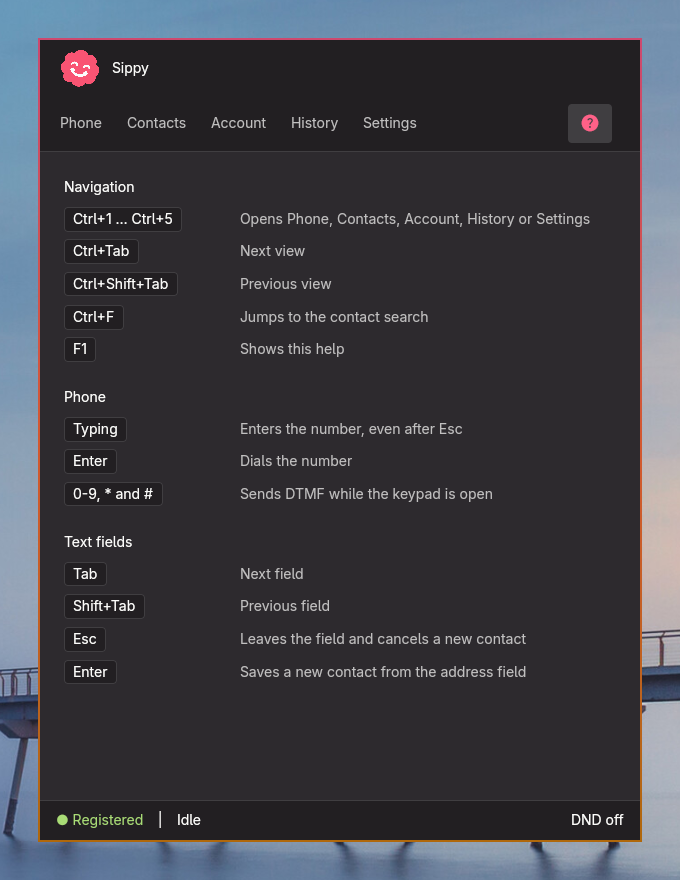](compact-help.png) |
| Incoming call | [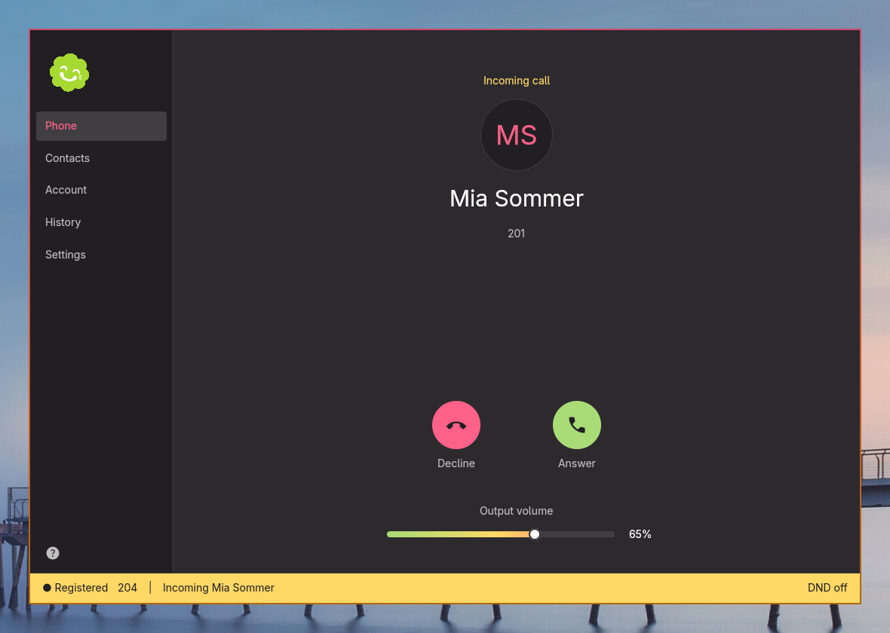](desktop-incoming.png) | [](compact-incoming.png) |

## Recreating the screenshots

Run this from the project directory in a running Hyprland session with `grim`:

```sh
cargo build --locked --example demo_screenshots
python3 scripts/capture-demo.py
```

The script opens a separate `Sippy Demo` window (app ID `sippy-demo`) on a free workspace and makes only that window opaque. It closes the window after the captures and returns to the previous workspace. The demo uses a temporary configuration directory. Window control goes through Hyprland's Lua dispatchers. The script also recreates `docs/demo-screenshots.zip` with the internal folder `sippy-demo/`.
